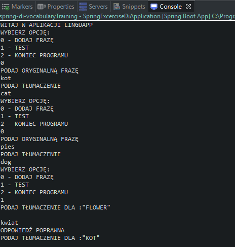
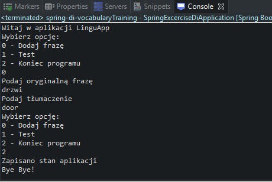

# Spring-di-vocabularyTraining
> App for learning words. (Maven, Spring Boot)

## Table of contents
* [General info](#general-info)
* [Screenshots](#screenshots)
* [Technologies](#technologies)
* [Status](#status)

## General info

Apps for learning words:
- adding new words to the database
- language test (creating a few phrases and translating them)

The application allows you to easily modify the format of the text viewed by the user.
The file name is stored in the application.properties file and then used in FileService.

Two profiles for file encryption:
- development - the text will not be encrypted -> dev
- production - the text will be encrypted with the Caesar cipher -> prod

Words are saved to a file when the application is closed.

## Screenshots

## Technologies
* JDK 9
* Maven 3.5.4
* Spring Boot 2.1.2

## Status
Project is: _finished_

